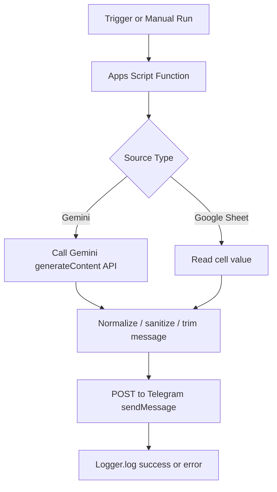
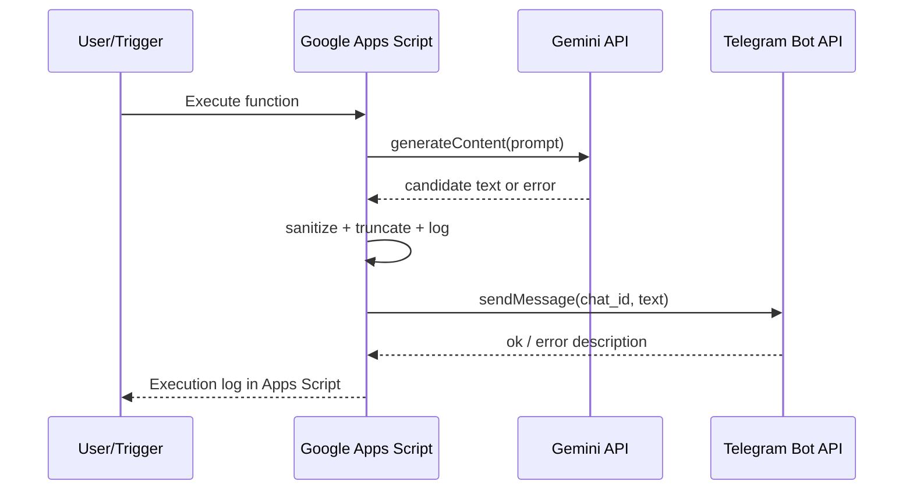

# GAS LogBridge: Google Apps Script Logging Library for Telegram

A lightweight, serverless logging and notification library for Google Apps Script that transforms generated content or spreadsheet events into structured Telegram-delivered operational logs.

[](#deployment)
[](README.md)
[](LICENSE)
[](https://developers.google.com/apps-script)

> [!NOTE]
> This repository currently ships Google Apps Script modules (`.gs`) that can be used as a reusable logging/notification foundation rather than as an NPM/PyPI-style package.

## Table of Contents
- [Features](#features)
- [Tech Stack \\& Architecture](#tech-stack--architecture)
- [Getting Started](#getting-started)
- [Testing](#testing)
- [Deployment](#deployment)
- [Usage](#usage)
- [Configuration](#configuration)
- [License](#license)
- [Support the Project](#support-the-project)

## Features
- Serverless execution model powered by Google Apps Script (no dedicated VM/container runtime required).
- Built-in integration path for LLM-generated logs/messages using Google Gemini API (`generateContent`).
- Telegram Bot API delivery pipeline for posting notifications, reports, and AI-generated summaries.
- Spreadsheet-driven message source support (read from Google Sheets and deliver to Telegram).
- Native Google Apps Script logging (`Logger.log`) for execution traceability.
- Basic message sanitization before Telegram delivery (removes Markdown-special characters).
- Long message trimming logic to fit Telegram message size constraints.
- Simple trigger compatibility (time-driven triggers for scheduled log push operations).
- Minimal footprint and low operational complexity for solo developers and small automation teams.

> [!IMPORTANT]
> The current implementation includes placeholder/static credential variables in source files. For production use, migrate secrets to `PropertiesService` immediately.

## Tech Stack & Architecture

### Core Technologies
- **Language:** Google Apps Script (ECMAScript-like JavaScript runtime).
- **Execution Platform:** Google Apps Script bound to Google Workspace assets (e.g., Google Sheets).
- **External APIs:**
  - Google Gemini API (`v1/models/{model}:generateContent`)
  - Telegram Bot API (`sendMessage`)
- **Data Source Option:** Google Sheets cell values for message payloads.

### Project Structure
```text
.
├── Gemeni_promt_bot.gs   # AI-generated content pipeline + Telegram delivery + execution logging
├── Google_Sheet.gs       # Spreadsheet cell extraction + Telegram delivery helper
├── LICENSE               # Apache License 2.0
└── README.md             # Project documentation
```

### Key Design Decisions
1. **Serverless-first approach:** Uses Apps Script as the orchestration runtime to eliminate infrastructure overhead.
2. **Pull-generate-push pipeline:** Generate text from AI provider, sanitize/trim output, then push to Telegram.
3. **Composable scripts:** Keeps AI and Sheets message producers separate so either source can be scheduled independently.
4. **Operational observability:** Uses `Logger.log` statements as first-line telemetry during execution and debugging.
5. **Fail-soft behavior:** Wraps network pipeline in `try/catch` and checks API error payloads before dispatch.

### Logging/Notification Pipeline


### Runtime Interaction Model


## Getting Started

### Prerequisites
- A Google account with access to:
  - Google Sheets
  - Google Apps Script editor
- A Telegram bot token from [@BotFather](https://t.me/botfather).
- A target Telegram `chat_id` (private chat, group, or channel).
- Optional (for AI pipeline): Google Gemini API key.

> [!TIP]
> Create a dedicated bot for automation workflows to isolate rate limits, auditability, and permissions from personal bots.

### Installation
1. Clone this repository locally:
   ```bash
   git clone https://github.com/<your-org-or-user>/GAP_AIpromt-telegram-bots.git
   cd GAP_AIpromt-telegram-bots
   ```
2. Create or open a Google Sheet (`https://sheets.new`).
3. Open **Extensions → Apps Script**.
4. Copy script content from `Gemeni_promt_bot.gs` and/or `Google_Sheet.gs` into the Apps Script editor.
5. Save the project and authorize required scopes on first run.
6. Configure credentials (see [Configuration](#configuration)).

## Testing

Because this is Apps Script-based, there is no built-in local unit-test harness in the repository. Use the following validation flow:

- **Unit-level function checks (manual):**
  - Run `sendTelegramMessage` with controlled Sheet input.
  - Run `generateAndSend` with a known, deterministic prompt.
- **Integration checks (API connectivity):**
  - Confirm Gemini response parsing path succeeds.
  - Confirm Telegram `ok: true` delivery response.
- **Static quality checks (recommended):**
  - Lint `.gs` files with ESLint configured for Apps Script globals.

Example local commands (optional tooling):
```bash
# Validate JavaScript syntax quickly (Node.js installed)
node --check Gemeni_promt_bot.gs
node --check Google_Sheet.gs

# Optional linting if you configure ESLint for GAS
npx eslint Gemeni_promt_bot.gs Google_Sheet.gs
```

> [!WARNING]
> `node --check` validates syntax only and does not emulate Apps Script runtime globals such as `UrlFetchApp`, `Logger`, or `SpreadsheetApp`.

## Deployment

### Production Deployment Model
1. Store secret material in Apps Script properties (`PropertiesService`) instead of hardcoded constants.
2. Restrict script access and enforce least-privilege sharing settings in Google Workspace.
3. Configure time-driven triggers for periodic log/report delivery.
4. Monitor execution logs and failed runs in Apps Script dashboard.

### CI/CD Guidance
Although this repository does not currently include CI workflows, a robust pipeline should include:
- Lint stage for `.gs` code quality.
- Secret scanning stage to prevent token leakage.
- Optional `clasp`-based deployment to Apps Script projects.

Example `clasp`-oriented flow:
```bash
npm install -g @google/clasp
clasp login
clasp create --type sheets --title "GAS LogBridge"
clasp push
```

### Containerization
- Not applicable for runtime execution (Apps Script is managed/serverless).
- Optional containers may still be used in CI for lint/test automation.

> [!CAUTION]
> Never expose `TELEGRAM_TOKEN` or `GEMINI_API_KEY` in public commits, screenshots, issue logs, or CI artifacts.

## Usage

### 1) AI-Generated Logging/Reporting Flow
```javascript
// Gemeni_promt_bot.gs
const GEMINI_API_KEY = 'YOUR_GEMINI_API_KEY';
const TELEGRAM_TOKEN = 'YOUR_TELEGRAM_TOKEN';
const CHAT_ID = 'YOUR_CHAT_ID';

function generateAndSend() {
  const prompt = 'Generate a concise daily operational report.';
  const modelName = 'gemini-2.5-flash-lite';
  const aiUrl = `https://generativelanguage.googleapis.com/v1/models/${modelName}:generateContent?key=${GEMINI_API_KEY}`;

  const aiPayload = {
    contents: [{ parts: [{ text: prompt }] }]
  };

  const aiResponse = UrlFetchApp.fetch(aiUrl, {
    method: 'post',
    contentType: 'application/json',
    payload: JSON.stringify(aiPayload),
    muteHttpExceptions: true
  });

  const json = JSON.parse(aiResponse.getContentText());
  let text = json.candidates?.[0]?.content?.parts?.[0]?.text || 'No content generated.';

  // Keep Telegram payload clean and bounded.
  text = text.replace(/[#*`]/g, '');
  if (text.length > 4000) text = text.substring(0, 3990) + '...';

  const tgUrl = `https://api.telegram.org/bot${TELEGRAM_TOKEN}/sendMessage`;
  UrlFetchApp.fetch(tgUrl, {
    method: 'post',
    contentType: 'application/json',
    payload: JSON.stringify({ chat_id: CHAT_ID, text }),
    muteHttpExceptions: true
  });

  Logger.log('Message dispatch attempt completed.');
}
```

### 2) Spreadsheet-Driven Message Dispatch
```javascript
// Google_Sheet.gs
function sendTelegramMessage() {
  var sheet = SpreadsheetApp.getActiveSpreadsheet().getActiveSheet();
  var token = 'YOUR_BOT_TOKEN';
  var chatId = 'YOUR_CHAT_ID';

  // Read payload from cell A1.
  var data = sheet.getRange('A1').getValue();

  var url = 'https://api.telegram.org/bot' + token + '/sendMessage';
  var payload = {
    chat_id: chatId,
    text: data
  };

  UrlFetchApp.fetch(url, {
    method: 'post',
    payload: payload
  });
}
```

### 3) Scheduling with Time-Driven Triggers
- Open Apps Script project.
- Go to **Triggers**.
- Add trigger for `generateAndSend` or `sendTelegramMessage`.
- Select frequency (minutes/hours/daily).

## Configuration

### Recommended Secret Management
Use Apps Script project properties:

```javascript
function getConfig() {
  const props = PropertiesService.getScriptProperties();
  return {
    TELEGRAM_TOKEN: props.getProperty('TELEGRAM_TOKEN'),
    CHAT_ID: props.getProperty('CHAT_ID'),
    GEMINI_API_KEY: props.getProperty('GEMINI_API_KEY'),
    MODEL_NAME: props.getProperty('MODEL_NAME') || 'gemini-2.5-flash-lite'
  };
}
```

### Environment Variables Mapping (Conceptual)
> [!NOTE]
> Apps Script does not use `.env` files natively. Treat Script Properties as your environment-variable equivalent.

| Key | Required | Default | Description |
|---|---|---|---|
| `TELEGRAM_TOKEN` | Yes | None | Bot token issued by BotFather. |
| `CHAT_ID` | Yes | None | Telegram destination chat/channel/group ID. |
| `GEMINI_API_KEY` | For AI flow | None | API key for Gemini model calls. |
| `MODEL_NAME` | No | `gemini-2.5-flash-lite` | Gemini model identifier for content generation. |
| `PROMPT_TEMPLATE` | No | Static in code | Template text for generated logs/reports. |

### Startup Flags and Runtime Controls
- There are no CLI startup flags in Apps Script deployment mode.
- Runtime behavior is controlled via:
  - Trigger schedule configuration.
  - Script properties.
  - Function selection during manual execution.

### Suggested Configuration File Structure (Optional Local Dev)
If you manage scripts with `clasp`, you may keep non-secret config templates locally:

```json
{
  "modelName": "gemini-2.5-flash-lite",
  "promptTemplate": "Generate concise incident summary",
  "maxMessageLength": 4000
}
```

## License
This project is licensed under the **Apache License 2.0**. See the [`LICENSE`](LICENSE) file for full terms.

## Support the Project

[](https://www.patreon.com/OstinFCT)
[](https://ko-fi.com/fctostin)
[](https://boosty.to/ostinfct)
[](https://www.youtube.com/@FCT-Ostin)
[](https://t.me/FCTostin)

If you find this tool useful, consider leaving a star on GitHub or supporting the author directly.
